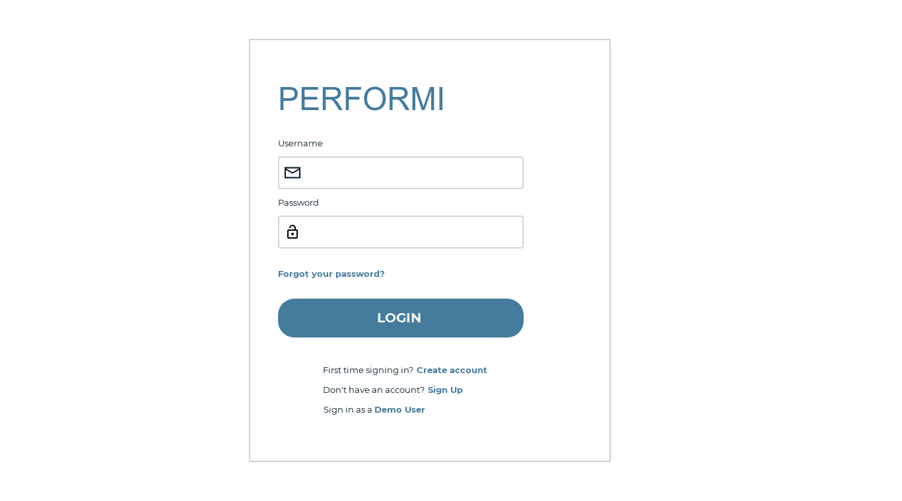

# Performi

## About The Project
- Performance Managment website that enables employees and managers within a company to send and recieve performance reviews
- 4 roles
    - Administrator: Manage users and the company account. Can view results of anyone from the entire organization.
    - HR: Can view results of anyone from the entire organization. 
    - Manager: Can only view the results of subordinates.
    - Employee: Can only view the result of themself. Can not create new appraisals but is allowed to send a peer review.  

- Allows for 360 degree feedback 

### Built With
- [![Bootstrap][Bootstrap.com]][Bootstrap-url]
- [![JQuery][JQuery.com]][JQuery-url]

## Design Screenshots
### Login Page

<!--  -->

<!-- MARKDOWN LINKS & IMAGES -->
<!-- https://www.markdownguide.org/basic-syntax/#reference-style-links -->
[Bootstrap.com]: https://img.shields.io/badge/Bootstrap-563D7C?style=for-the-badge&logo=bootstrap&logoColor=white
[Bootstrap-url]: https://getbootstrap.com
[JQuery.com]: https://img.shields.io/badge/jQuery-0769AD?style=for-the-badge&logo=jquery&logoColor=white
[JQuery-url]: https://jquery.com
